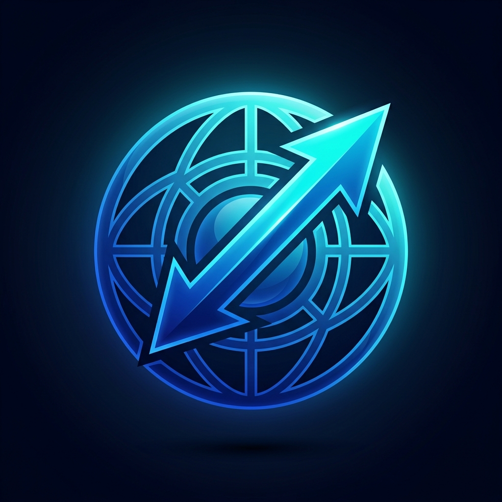

<div align="center">
  

  # Open Download Manager (ODM)
  
  **The ultimate blazing fast, multi-platform, modern download manager built with Electron and React.**

  [](https://opensource.org/licenses/MIT)
  [](#)
  [](#)
  [](#)
  [](#)
  [](http://makeapullrequest.com)

  [Features](#-key-features) •
  [Installation](#-installation) •
  [Usage](#-usage) •
  [Roadmap](#-roadmap) •
  [Contributing](#-contributing)
</div>

<br />

## 🌟 Introduction

**Open Download Manager (ODM)** is an advanced, open-source alternative to traditional premium download managers. It was engineered from the ground up to provide maximum bandwidth utilization, unparalleled reliability, and a breathtaking modern interface. 

Whether you are downloading massive media files, handling broken internet connections, or scheduling thousands of links, ODM provides a robust, developer-friendly, and beautifully designed solution that works natively across all major operating systems.

---

## 🚀 Key Features

### ⚡ Blazing Fast Downloads
- **Dynamic File Segmentation:** Automatically splits files into multiple parts and downloads them simultaneously, accelerating download speeds by up to 5x.
- **Connection Multiplexing:** Utilizes advanced algorithms to keep connections alive and maximize throughput.

### 🎨 Premium Modern UI
- **Sleek Aesthetic:** Crafted using custom Vanilla CSS with deep electric blues, neon accents, and smooth glassmorphism effects.
- **Micro-Animations:** Fluid transitions and interactive elements powered by Framer Motion.
- **Dark Mode Native:** Designed specifically for developer and power-user eye comfort.

### 🛡️ Bulletproof Reliability
- **Pause & Resume Engine:** Resume broken or interrupted downloads without data loss or corruption.
- **Auto-Recovery:** Intelligent connection retries for unstable network environments.
- **Checksum Verification:** Ensures file integrity upon completion.

### 📊 Advanced Management
- **Smart Queues:** Group, prioritize, and schedule your downloads.
- **Browser Integration:** Ready to be paired with Chrome/Firefox extensions to catch downloads automatically.
- **Custom Categories:** Automatically sort downloads into Music, Videos, Documents, and Programs based on file extensions.

---

## 📱 Cross-Platform Compatibility

ODM is designed to be truly universal:

- **Windows:** Native `.exe` and NSIS installers.
- **macOS:** Universal `.dmg` builds supporting both Intel and Apple Silicon.
- **Linux:** Distro-agnostic `.AppImage` and `.deb` packaging.
- **Mobile (iOS & Android):** Includes a Progressive Web App (PWA) manifest. You can run the ODM web interface from a server and install it directly to your iOS or Android home screen for on-the-go management.

---

## 🛠️ Technology Stack

ODM is built on the shoulders of modern web and desktop technologies:

| Layer | Technology | Description |
| :--- | :--- | :--- |
| **Desktop Shell** | [Electron](https://electronjs.org/) | Provides native OS integration, file system access, and rendering. |
| **Frontend Framework**| [React 19](https://react.dev/) | The core UI engine, leveraging modern hooks and concurrent features. |
| **Build Tool** | [Vite](https://vitejs.dev/) | Next-generation frontend tooling for instantaneous HMR and optimized builds. |
| **Animations** | [Framer Motion](https://www.framer.com/motion/) | Powers the dynamic, physics-based micro-interactions. |
| **Packaging** | [Electron Builder](https://www.electron.build/) | Compiles the application into OS-specific executables. |
| **Native Core** | [C++ (Node-API)](https://nodejs.org/api/n-api.html) | High-performance multithreaded native addon for raw download speeds. |

---

## ⚙️ Installation

### Prerequisites
Ensure you have the following installed on your machine:
- **Node.js** (v18.0.0 or higher)
- **Git**

### Developer Setup

1. **Clone the repository:**
   ```bash
   git clone https://github.com/ImranDev3/open-download-manager.git
   cd open-download-manager
   ```

2. **Install all required dependencies:**
   Using npm:
   ```bash
   npm install
   ```

3. **Start the Development Environment:**
   This command starts both the Vite hot-reloading dev server and the Electron wrapper simultaneously:
   ```bash
   npm run electron:start
   ```

---

## 📦 Building for Production

You can compile ODM into a native, standalone executable for your operating system.

- **For Windows (.exe):**
  ```bash
  npm run build:electron
  ```
  *Output will be located in the `release/` directory.*

- **For macOS (.dmg):**
  Update your `package.json` scripts to run `electron-builder --mac` and execute it on a macOS machine.

- **For Linux (.AppImage):**
  Update your `package.json` scripts to run `electron-builder --linux` and execute it on a Linux machine.

---

## 🗺️ Roadmap

We have ambitious plans for ODM! Here's what is coming up:

- [ ] **Browser Extensions:** Official extensions for Chrome, Edge, and Firefox.
- [ ] **Torrent Support:** Native handling of `.torrent` files and magnet links.
- [ ] **Cloud Sync:** Sync your download history and settings across multiple devices.
- [ ] **Bandwidth Limiter:** Granular controls for upload and download speed caps.
- [ ] **Themes:** Custom theme support and a vibrant community theme store.

---

## 🤝 Contributing

We welcome contributions from the community! Whether it's a bug report, a new feature, or a typo fix, your help is appreciated.

1. **Fork the repository**
2. **Create your feature branch:** `git checkout -b feature/AmazingFeature`
3. **Commit your changes:** `git commit -m 'Add some AmazingFeature'`
4. **Push to the branch:** `git push origin feature/AmazingFeature`
5. **Open a Pull Request**

Please read our `CONTRIBUTING.md` (coming soon) for details on our code of conduct and the process for submitting pull requests.

---

## 📄 License

Distributed under the MIT License. See `LICENSE` for more information.

<br />

<div align="center">
  <b>Built with passion by <a href="https://github.com/ImranDev3">ImranDev3</a> and the open-source community.</b>
</div>
